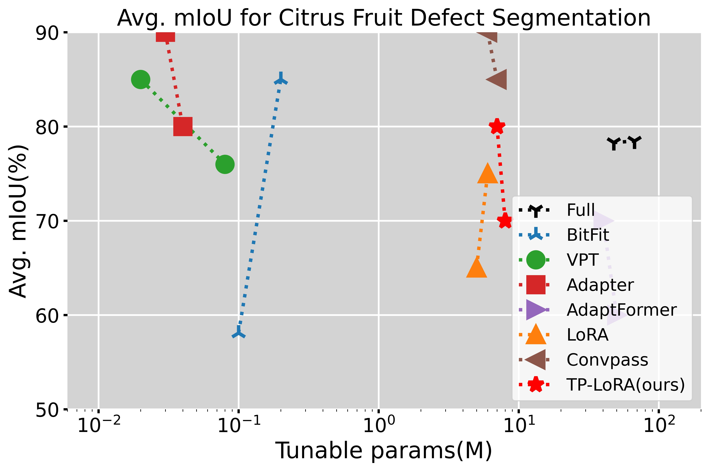
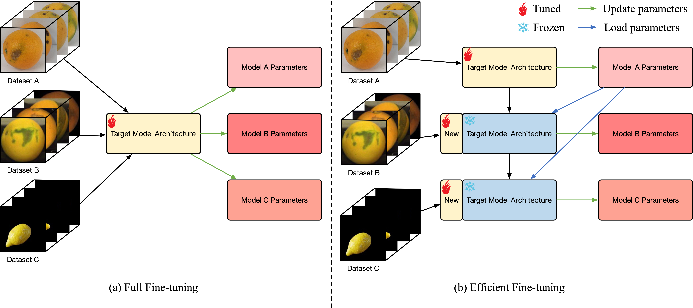
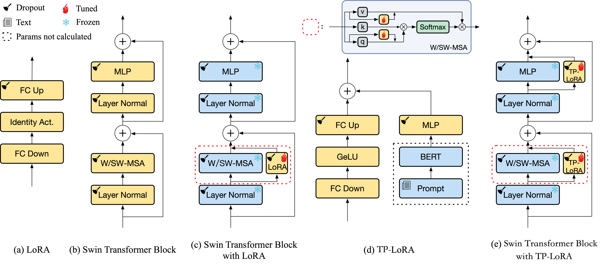
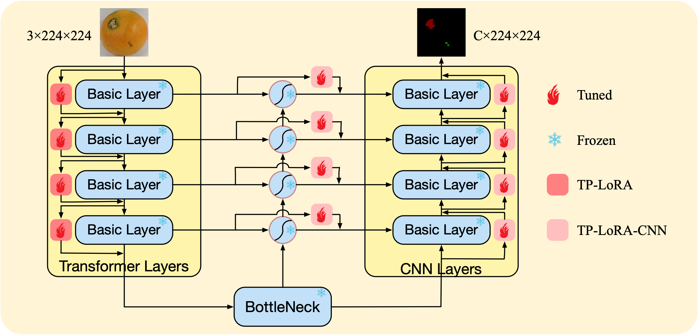

## TP-LoRA: Parameter-Efficient Fine-Tuning for citrus fruit defect segmentation model based on text prompt.

[中文](README_CH.md)

This is the official repository for our recent work: TP-LoRA([PDF]())

### News
---

### Highlights
---

* Performance of different methods on citrus fruit datasets against their tuned params:

<p align="center">

</p>

### Updates

- [x] Code and datasets are available here.(January/30/2024)
- [x] Experimental results are available.(February/26/2024)

### Overview
---
* Workflow for parameter efficient fine-tuning (PEFT) of model for defective segmentation of citrus fruits:




* Overview of the basic architecture of our proposed LoRA PEFT method based on text prompt (TP-LoRA):



* Scheme for the application of the TP-LoRA to the basic model of the Swin-Att-UNet:



### Datasets
---

* Citrus fruit defects datasets:

| Datasets | Image size | Quantities | Enhance | Usage | Link |
|:--------------------:|:----------------:|:-----------------:|:----------------:|:----------------:|:----------------:|
| Orange-Navel-4.5k | $512\times 512$ | 4344 | True| Pretrain|[download]()|
| Orange-Navel-5.3k | $144\times 144$ | 5290 | False | PEFT | × |
| Lemon-2.7k | $1024\times 1024$ | 2690 | False | PEFT | [download]() |
| Grapefruit-1.9k | $512\times 512$ | 1933 | False | PEFT | [download]() |

x: The dataset is not publicly available for commercial reasons.

*Note: We only provide 1448 navel orange defect original dataset in Orange-Navel-4.5k, if you want to extend the dataset, you can use [Imgaug for segmentation maps and masks](https://imgaug.readthedocs.io/en/latest/source/examples_segmentation_maps.html) for data enhancement.*


### Pretrained Models
---
* Pretrained backbone network:

| Model(Imagenet-1k) | Input size | ckpt |
|:--------------------:|:---------------------:|:---------------------:|
| Swin-Tiny | $224\times 224$ | [download]() |
| Swin-Small | $224\times 224$ | [download]() |

* Pretrained basic segmentation network:

| Model(Orange-Navel-4.5k) | Input size | mIoU(%) | ckpt |
|:--------------------:|:---------------------:|:---------------------:|:---------------------:|
| Swin-T-Att-UNet | $224\times 224$ | 89.75 | [download]() |
| Swin-S-Att-UNet | $224\times 224$ | 89.92 | [download]() |

* Text encode network:

| Model | ckpt |
|:--------------------:|:---------------------:|
| Bert-base |  [download]() |

### Results
---

* Full performance (mIoU) on the citrus datasets benchmark:

<table>
    <tr>
	    <th colspan="8">Comparison of the effects of different PEFT methods.</th>
	</tr >
	<tr>
	    <td rowspan="2" style="text-align: center;">Method</td>
	    <td rowspan="2" style="text-align: center;">Backbone</td>
        <td rowspan="2" style="text-align: center;">Params(M)</td> 
      <td colspan="4" style="text-align: center;">mIoU(%)</td>
	</tr >
    <tr> 
      <td style="text-align: center;">ON-5.3k</td> 
      <td style="text-align: center;">L-2.7k</td>
      <td style="text-align: center;">G-1.9k</td>
      <td style="text-align: center;">Avg.</td>
	</tr >
    <tr>
	    <td style="text-align: center;">Full</td>
	    <td rowspan="9" style="text-align: center;">Swin-Tiny</td>
	    <td style="text-align: center;">45.75</td>  
      <td style="text-align: center;">78.46</td>
      <td style="text-align: center;">64.32</td>
      <td style="text-align: center;">67.70</td>
      <td style="text-align: center;">70.16</td>
	</tr >
    <tr>
	    <td style="text-align: center;">Classify</td>
	    <td style="text-align: center;">0</td>  
      <td style="text-align: center;">16.75</td>
      <td style="text-align: center;">18.11</td>
      <td style="text-align: center;">30.76</td>
      <td style="text-align: center;">21.87</td>
	</tr >
    <tr>
	    <td style="text-align: center;">BitFit</td>
	    <td style="text-align: center;">0.09</td>  
      <td style="text-align: center;">58.10</td>
      <td style="text-align: center;">40.88</td>
      <td style="text-align: center;">54.20</td>
      <td style="text-align: center;">51.06</td>
	</tr >
    <tr>
	    <td style="text-align: center;">VPT</td>
	    <td style="text-align: center;">3.18</td>  
      <td style="text-align: center;">60.47</td>
      <td style="text-align: center;">36.64</td>
      <td style="text-align: center;">53.71</td>
      <td style="text-align: center;">50.27</td>
	</tr >
    <tr>
	    <td style="text-align: center;">Adapter</td>
	    <td style="text-align: center;">2.52</td>  
      <td style="text-align: center;">75.63</td>
      <td style="text-align: center;">61.10</td>
      <td style="text-align: center;">68.95</td>
      <td style="text-align: center;">68.56</td>
	</tr >
    <tr>
	    <td style="text-align: center;">AdaptFormer</td>
	    <td style="text-align: center;">0.81</td>  
      <td style="text-align: center;">70.32</td>
      <td style="text-align: center;">54.37</td>
      <td style="text-align: center;">57.18</td>
      <td style="text-align: center;">60.62</td>
	</tr >
    <tr>
	    <td style="text-align: center;">LoRA</td>
	    <td style="text-align: center;">0.17</td>  
      <td style="text-align: center;">69.43</td>
      <td style="text-align: center;">56.66</td>
      <td style="text-align: center;">60.06</td>
      <td style="text-align: center;">62.05</td>
	</tr >
    <tr>
	    <td style="text-align: center;">Convpass</td>
	    <td style="text-align: center;">0.20</td>  
      <td style="text-align: center;">70.04</td>
      <td style="text-align: center;">50.32</td>
      <td style="text-align: center;">59.03</td>
      <td style="text-align: center;">59.80</td>
	</tr >
    <tr>
	    <td style="text-align: center;">TP-LoRA(ours)</td>
	    <td style="text-align: center;">0.32</td>  
      <td style="text-align: center;">76.98</td>
      <td style="text-align: center;">62.59</td>
      <td style="text-align: center;">68.17</td>
      <td style="text-align: center;">69.25</td>
	</tr >
	<tr>
	    <td style="text-align: center;">Full</td>
	    <td rowspan="9" style="text-align: center;">Swin-Small</td>
	    <td style="text-align: center;">67.05</td>  
      <td style="text-align: center;">78.30</td>
      <td style="text-align: center;">64.17</td>
      <td style="text-align: center;">69.20</td>
      <td style="text-align: center;">70.56</td>
	</tr >
    <tr>
	    <td style="text-align: center;">Classify</td>
	    <td style="text-align: center;">0</td>  
      <td style="text-align: center;">17.07</td>
      <td style="text-align: center;">18.54</td>
      <td style="text-align: center;">30.75</td>
      <td style="text-align: center;">22.12</td>
	</tr >
    <tr>
	    <td style="text-align: center;">BitFit</td>
	    <td style="text-align: center;">0.16</td>  
      <td style="text-align: center;">61.15</td>
      <td style="text-align: center;">48.43</td>
      <td style="text-align: center;">54.52</td>
      <td style="text-align: center;">54.70</td>
	</tr >
    <tr>
	    <td style="text-align: center;">VPT</td>
	    <td style="text-align: center;">3.31</td>  
      <td style="text-align: center;">64.17</td>
      <td style="text-align: center;">41.13</td>
      <td style="text-align: center;">54.14</td>
      <td style="text-align: center;">53.15</td>
	</tr >
    <tr>
	    <td style="text-align: center;">Adapter</td>
	    <td style="text-align: center;">4.30</td>  
      <td style="text-align: center;">76.86</td>
      <td style="text-align: center;">60.21</td>
      <td style="text-align: center;">68.95</td>
      <td style="text-align: center;">68.67</td>
	</tr >
    <tr>
	    <td style="text-align: center;">AdaptFormer</td>
	    <td style="text-align: center;">1.40</td>  
      <td style="text-align: center;">73.76</td>
      <td style="text-align: center;">61.02</td>
      <td style="text-align: center;">65.06</td>
      <td style="text-align: center;">66.61</td>
	</tr >
    <tr>
	    <td style="text-align: center;">LoRA</td>
	    <td style="text-align: center;">0.32</td>  
      <td style="text-align: center;">71.30</td>
      <td style="text-align: center;">60.25</td>
      <td style="text-align: center;">64.07</td>
      <td style="text-align: center;">65.21</td>
	</tr >
    <tr>
	    <td style="text-align: center;">Convpass</td>
	    <td style="text-align: center;">0.37</td>  
      <td style="text-align: center;">73.62</td>
      <td style="text-align: center;">62.18</td>
      <td style="text-align: center;">66.01</td>
      <td style="text-align: center;">67.27</td>
	</tr >
    <tr>
	    <td style="text-align: center;">TP-LoRA(ours)</td>
	    <td style="text-align: center;">0.53</td>  
      <td style="text-align: center;">77.25</td>
      <td style="text-align: center;">64.32</td>
      <td style="text-align: center;">68.69</td>
      <td style="text-align: center;">70.09</td>
	</tr >
</table>

ON-5.3k: Orange-Navel-5.3k dataset.

L-2.7k: Lemon-2.7k dataset.

G-1.9k: Grapefruit-1.9k dataset.

Avg.: Average.

Full: Update parameters for the entire network.

Classify: Update only the parameters in the header section of the classification.


### Usages
---
#### Dependentment
* Prepare your environment：
```shell
$ git clone https://github.com/caixiongjiang/TP-LoRA.git
$ conda activate "your anaconda environment"
$ pip install -r requirements.txt
```

#### Pretrain
* Download the pretrained backbone network weight and put them into `model_data` dir.

* Modify the parameters of `train.py`. For example, train Swin-T-Att-UNet on Orange-Navel-4.5k with batch size of 8:
```python
num_classes = 3 + 1
backbone    = "swin_T_224" # swin_T_224, swin_S_224
pretrained  = False
model_path  = "model_data/swin_tiny_patch4_window7_224_1k.pth"
input_shape = [224, 224]
Init_Epoch          = 0
Freeze_Epoch        = 0
Freeze_batch_size   = 8
UnFreeze_Epoch      = 500
Unfreeze_batch_size = 8
VOCdevkit_path  = 'datasets/Orange-Navel-4.5k'

model = swinTS_Att_Unet(num_classes=num_classes, pretrained=pretrained, backbone=backbone).train()

# Use backbone network train BaseModel
pretrained_dict = torch.load(model_path, map_location=device)["model"] 

# Use backbone network train BaseModel
backbone_stat_dict = {} 
    for i in pretrained_dict.keys():
        backbone_stat_dict["swin_backbone." + i] = pretrained_dict[i]
        pretrained_dict.update(backbone_stat_dict) 
```
* Train:
```
python3 train.py
# Multi-graphics machines designated for single-card training
CUDA_VISIBLE_DEVICES={gpu number} python3 train.py
``` 

#### PEFT
* Put your basic segmentation network weights into `model_data` dir.

* Modify the parameters of `train.py`. For example, train TP-LoRA on Orange-Navel-5.3k with batch size of 8:
```python
num_classes = 5 + 1
backbone    = "swin_T_224" # swin_T_224, swin_S_224
pretrained  = False
model_path  = "model_data/Swin-T-Att-UNet-Orange-Navel-4.5k.pth"
input_shape = [224, 224]
Init_Epoch          = 0
Freeze_Epoch        = 0
Freeze_batch_size   = 8
UnFreeze_Epoch      = 500
Unfreeze_batch_size = 8
VOCdevkit_path  = 'datasets/Orange-Navel-5.3k'

Update_TP_LoRA_Set(mlp_dim=0.25, lora_dim=8, act='ReLU', in_location='ATT', out_location='DEEP')
model = TP_LoRA(text_size='LARGE', dataset='Orange-Navel', num_classes=num_classes, pretrained=pretrained, backbone=backbone).train()

pretrained_dict = torch.load(model_path, map_location=device)
```
* Train:
```python
python3 train.py
# Multi-graphics machines designated for single-card training
CUDA_VISIBLE_DEVICES={gpu number} python3 train.py
```

#### Test & Predict & Parameter count & Visualization

* For example, download the TP-LoRA methods' weight and put them into 
`logs/Navel-Orange-5.3k/Swin-Tiny/TP-LoRA` dir.
* modify the parameters of `unet.py`. For example, evaluate TP-LoRA method:
```python
_defaults = {
        "model_path"    : 'logs/Navel-Orange-5.3k/Swin-Tiny/TP-LoRA/best.pth',
        "num_classes"   : 5 + 1,
        "backbone"      : "swin_T_224",
        "input_shape"   : [224, 224],
        "mix_type"      : 1,
        "cuda"          : True,  
    }

def generate(self, onnx=False):
    Update_TP_LoRA_Set(mlp_dim=0.25, lora_dim=8, act='ReLU', in_location='ATT', out_location='DEEP')
    self.net = TP_LoRA(text_size='LARGE', dataset='Orange-Navel', num_classes=self.num_classes, backbone=self.backbone)
```
* Evaluate the test set on Navel-Orange-5.3k and the result will be in the `miou_out` dir:
```shell
python3 get_miou.py
```

* Use model predict images:
```shell
python3 predict.py
# Generate tips and input the image dir 
Input image filename:'your image dir'
```

* Testing the size and percentage of tuning parameters for different methods：
```python
python3 summary.py
```

* Class-activated mask visualization of TP-LoRA modules for each layer using the LayerCAM method：
```python
python3 visualization.py
```


### Citation
---

```bib

```
### Acknowledgement
---

* This implementation is based on [unet-pytorch](https://github.com/bubbliiiing/unet-pytorch).
* Some PEFT comparison methods refer to [PETL-ViT](https://github.com/JieShibo/PETL-ViT) this repository.
* LayerCAM visualization code referenced in [pytorch-grad-cam](https://github.com/jacobgil/pytorch-grad-cam) repository.

