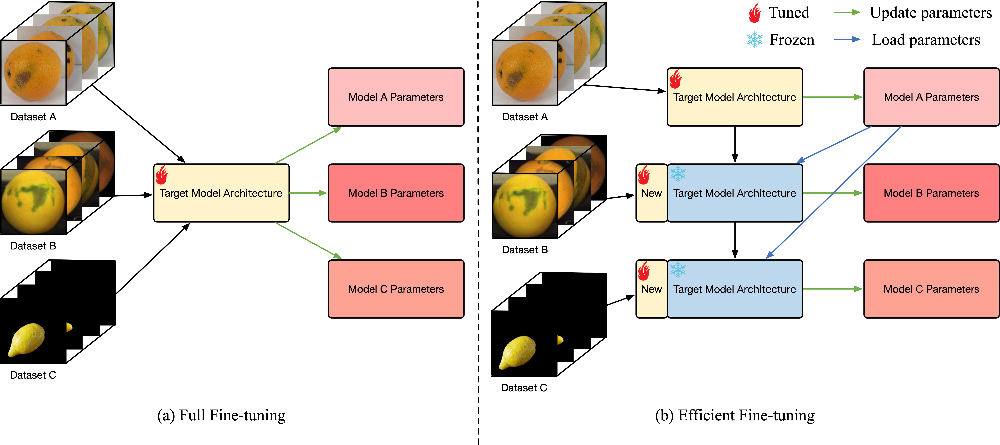

## Parameter-Efficient Fine-Tuning for citrus fruit defect segmentation model based on text prompt.

[English](README.md)

这是我们不久前工作的官方资料库：TP-LoRA([PDF](https://doi.org/10.1016/j.engappai.2025.111765)

### 新闻
---
这项工作于2025年7月10日被`Engineering Applications of Artificial Intelligence`期刊接收。

### 亮点
---

* 不同方法在柑橘类水果数据集上的性能对比其调整的参数量：

<p align="center">

</p>

### 更新
---
- [x] 完成代码和数据集的上传。（2024 1.30）
- [x] 完成实验结果的上传。（2024 2.26）
- [x] 根据评审要求更新代码和培训日志。（2024 10.11）


### 概述
---
* 柑橘类水果缺陷分割模型的参数高效微调（PEFT）工作流程：




* 我们提出的基于文本提示的LoRA PEFT方法（TP-LoRA）的基本架构概览：


* 将TP-LoRA应用于Swin-Att-UNet基本模型的方案：


### 数据集
---
* 柑橘类水果缺陷数据集：

| Datasets | Image size | Quantities | Enhance | Usage | Link |
|:--------------------:|:----------------:|:-----------------:|:----------------:|:----------------:|:----------------:|
| Orange-Navel-4.5k | $512\times 512$ | 4344 | True| Pretrain|[download](https://github.com/caixiongjiang/TP-LoRA/releases/download/v1.0.0/Orange-Navel-1.5k.zip)|
| Orange-Navel-5.3k | $144\times 144$ | 5290 | False | PEFT | × |
| Lemon-2.7k | $1024\times 1024$ | 2690 | False | PEFT | [download](https://github.com/caixiongjiang/TP-LoRA/releases/download/v1.0.0/Lemon-2.7k.zip) |
| Grapefruit-1.9k | $512\times 512$ | 1933 | False | PEFT | [download](https://github.com/caixiongjiang/TP-LoRA/releases/download/v1.0.0/GrapeFruit-1.9k.zip) |

x: 出于商业原因，该数据集不公开。

*注意：我们仅在Orange-Navel-4.5k中提供1448个肚脐橙色缺陷原始数据集，如果您想扩展数据集，您可以使用[Imgaug for segmentation maps and mask](https://imgaug.readthedocs.io/en/latest/source/examples_segmentation_maps.html)来增强数据。*

### 预训练模型
---
* 预训练的骨干网络：

| Model(Imagenet-1k) | Input size | ckpt |
|:--------------------:|:---------------------:|:---------------------:|
| Swin-Tiny | $224\times 224$ | [download](https://github.com/caixiongjiang/TP-LoRA/releases/download/v1.0.0/swin_tiny_patch4_window7_224_1k.pth) |
| Swin-Small | $224\times 224$ | [download](https://github.com/caixiongjiang/TP-LoRA/releases/download/v1.0.0/swin_small_patch4_window7_224_1k.pth) |
| Convnext-Tiny | $224\times 224$ | [download](https://github.com/caixiongjiang/TP-LoRA/releases/download/v1.0.1/convnext_tiny_1k_224_ema.pth) |
| ResNet50 | $224\times 224$ | [download](https://github.com/caixiongjiang/TP-LoRA/releases/download/v1.0.1/resnet50-19c8e357.pth) |

* 预训练的基本分割网络：

| Model(Orange-Navel-4.5k) | Input size | mIoU(%) | ckpt |
|:--------------------:|:---------------------:|:---------------------:|:---------------------:|
| Swin-T-Att-UNet | $224\times 224$ | 89.75 | [download](https://github.com/caixiongjiang/TP-LoRA/releases/download/v1.0.0/Swin-T-Att-UNet-Orange-Navel-4.5k.pth) |
| Swin-S-Att-UNet | $224\times 224$ | 89.92 | [download](https://github.com/caixiongjiang/TP-LoRA/releases/download/v1.0.0/Swin-S-Att-UNet-Orange-Navel-4.5k.pth) |
| Convnext-T-Att-UNet | $224\times 224$ | 78.54 | [download](https://github.com/caixiongjiang/TP-LoRA/releases/download/v1.0.1/Convnext-T-Att-UNet-Orange-Navel-4.5k.pth) |
| ResNet50-Att-UNet | $224\times 224$ | 85.27 | [download](https://github.com/caixiongjiang/TP-LoRA/releases/download/v1.0.1/ResNet50-Att-UNet-Orange-Navel-4.5k.pth) |

* 文本编码网络：

| Model | ckpt |
|:--------------------:|:---------------------:|
| Bert-base |  [download](https://github.com/caixiongjiang/TP-LoRA/releases/download/v1.0.0/bert-base.zip) |

### 结果
---
* 柑橘数据集基准的全面性能（mIoU）：

<table>
    <tr>
	    <th colspan="8">Comparison of the effects of different PEFT methods.</th>
	</tr >
	<tr>
	    <td rowspan="2" style="text-align: center;">Method</td>
	    <td rowspan="2" style="text-align: center;">Backbone</td>
        <td rowspan="2" style="text-align: center;">Params(M)</td> 
      <td colspan="4" style="text-align: center;">mIoU(%)</td>
	</tr >
    <tr> 
      <td style="text-align: center;">ON-5.3k</td> 
      <td style="text-align: center;">L-2.7k</td>
      <td style="text-align: center;">G-1.9k</td>
      <td style="text-align: center;">Avg.</td>
	</tr >
    <tr>
	    <td style="text-align: center;">Full</td>
	    <td rowspan="9" style="text-align: center;">Swin-Tiny</td>
	    <td style="text-align: center;">45.75</td>  
      <td style="text-align: center;"><b>78.46</td>
      <td style="text-align: center;"><b>64.32</td>
      <td style="text-align: center;">67.70</td>
      <td style="text-align: center;"><b>70.16</td>
	</tr >
    <tr>
	    <td style="text-align: center;">Classify</td>
	    <td style="text-align: center;">0</td>  
      <td style="text-align: center;">16.75</td>
      <td style="text-align: center;">18.11</td>
      <td style="text-align: center;">30.76</td>
      <td style="text-align: center;">21.87</td>
	</tr >
    <tr>
	    <td style="text-align: center;">BitFit</td>
	    <td style="text-align: center;">0.09</td>  
      <td style="text-align: center;">58.10</td>
      <td style="text-align: center;">40.88</td>
      <td style="text-align: center;">54.20</td>
      <td style="text-align: center;">51.06</td>
	</tr >
    <tr>
	    <td style="text-align: center;">VPT</td>
	    <td style="text-align: center;">3.18</td>  
      <td style="text-align: center;">60.47</td>
      <td style="text-align: center;">36.64</td>
      <td style="text-align: center;">53.71</td>
      <td style="text-align: center;">50.27</td>
	</tr >
    <tr>
	    <td style="text-align: center;">Adapter</td>
	    <td style="text-align: center;">2.52</td>  
      <td style="text-align: center;">75.63</td>
      <td style="text-align: center;">61.10</td>
      <td style="text-align: center;">68.95</td>
      <td style="text-align: center;">68.56</td>
	</tr >
    <tr>
	    <td style="text-align: center;">AdaptFormer</td>
	    <td style="text-align: center;">0.81</td>  
      <td style="text-align: center;">70.32</td>
      <td style="text-align: center;">54.37</td>
      <td style="text-align: center;">57.18</td>
      <td style="text-align: center;">60.62</td>
	</tr >
    <tr>
	    <td style="text-align: center;">LoRA</td>
	    <td style="text-align: center;">0.17</td>  
      <td style="text-align: center;">69.43</td>
      <td style="text-align: center;">56.66</td>
      <td style="text-align: center;">60.06</td>
      <td style="text-align: center;">62.05</td>
	</tr >
    <tr>
	    <td style="text-align: center;">Convpass</td>
	    <td style="text-align: center;">0.20</td>  
      <td style="text-align: center;">70.04</td>
      <td style="text-align: center;">50.32</td>
      <td style="text-align: center;">59.03</td>
      <td style="text-align: center;">59.80</td>
	</tr >
    <tr>
	    <td style="text-align: center;">TP-LoRA(ours)</td>
	    <td style="text-align: center;">0.32</td>  
      <td style="text-align: center;">76.98</td>
      <td style="text-align: center;">62.59</td>
      <td style="text-align: center;"><b>68.17</td>
      <td style="text-align: center;">69.25</td>
	</tr >
	<tr>
	    <td style="text-align: center;">Full</td>
	    <td rowspan="9" style="text-align: center;">Swin-Small</td>
	    <td style="text-align: center;">67.05</td>  
      <td style="text-align: center;"><b>78.30</td>
      <td style="text-align: center;">64.17</td>
      <td style="text-align: center;"><b>69.20</td>
      <td style="text-align: center;"><b>70.56</td>
	</tr >
    <tr>
	    <td style="text-align: center;">Classify</td>
	    <td style="text-align: center;">0</td>  
      <td style="text-align: center;">17.07</td>
      <td style="text-align: center;">18.54</td>
      <td style="text-align: center;">30.75</td>
      <td style="text-align: center;">22.12</td>
	</tr >
    <tr>
	    <td style="text-align: center;">BitFit</td>
	    <td style="text-align: center;">0.16</td>  
      <td style="text-align: center;">61.15</td>
      <td style="text-align: center;">48.43</td>
      <td style="text-align: center;">54.52</td>
      <td style="text-align: center;">54.70</td>
	</tr >
    <tr>
	    <td style="text-align: center;">VPT</td>
	    <td style="text-align: center;">3.31</td>  
      <td style="text-align: center;">64.17</td>
      <td style="text-align: center;">41.13</td>
      <td style="text-align: center;">54.14</td>
      <td style="text-align: center;">53.15</td>
	</tr >
    <tr>
	    <td style="text-align: center;">Adapter</td>
	    <td style="text-align: center;">4.30</td>  
      <td style="text-align: center;">76.86</td>
      <td style="text-align: center;">60.21</td>
      <td style="text-align: center;">68.95</td>
      <td style="text-align: center;">68.67</td>
	</tr >
    <tr>
	    <td style="text-align: center;">AdaptFormer</td>
	    <td style="text-align: center;">1.40</td>  
      <td style="text-align: center;">73.76</td>
      <td style="text-align: center;">61.02</td>
      <td style="text-align: center;">65.06</td>
      <td style="text-align: center;">66.61</td>
	</tr >
    <tr>
	    <td style="text-align: center;">LoRA</td>
	    <td style="text-align: center;">0.32</td>  
      <td style="text-align: center;">71.30</td>
      <td style="text-align: center;">60.25</td>
      <td style="text-align: center;">64.07</td>
      <td style="text-align: center;">65.21</td>
	</tr >
    <tr>
	    <td style="text-align: center;">Convpass</td>
	    <td style="text-align: center;">0.37</td>  
      <td style="text-align: center;">73.62</td>
      <td style="text-align: center;">62.18</td>
      <td style="text-align: center;">66.01</td>
      <td style="text-align: center;">67.27</td>
	</tr >
    <tr>
	    <td style="text-align: center;">TP-LoRA(ours)</td>
	    <td style="text-align: center;">0.53</td>  
      <td style="text-align: center;">77.25</td>
      <td style="text-align: center;"><b>64.32</td>
      <td style="text-align: center;">68.69</td>
      <td style="text-align: center;">70.09</td>
	</tr >
</table>

ON-5.3k: Orange-Navel-5.3k数据集。

L-2.7k: Lemon-2.7k数据集。

G-1.9k: Grapefruit-1.9k数据集。

Avg.: 平均。

Full: 更新整个网络的参数。

Classify: 仅更新分类头部分中的参数。

### 使用

#### 依赖
* 准备你的环境：
```shell
$ git clone https://github.com/caixiongjiang/TP-LoRA.git
$ conda activate "your anaconda environment"
$ pip install -r requirements.txt
```

#### 预训练
* 下载预训练的骨干网络权重，并将其放入`model_data`目录中。

* 修改`train.py`的参数。例如，在Orange-Navel-4.5k上训练Swin-T-Att-UNet，批次大小为8：
```python
num_classes = 3 + 1
backbone    = "swin_T_224" # swin_T_224, swin_S_224
pretrained  = False
model_path  = "model_data/swin_tiny_patch4_window7_224_1k.pth"
input_shape = [224, 224]
Init_Epoch          = 0
Freeze_Epoch        = 0
Freeze_batch_size   = 8
UnFreeze_Epoch      = 500
Unfreeze_batch_size = 8
VOCdevkit_path  = 'datasets/Orange-Navel-4.5k'

model = swinTS_Att_Unet(num_classes=num_classes, pretrained=pretrained, backbone=backbone).train()

# Use backbone network train BaseModel
pretrained_dict = torch.load(model_path, map_location=device)["model"] 

# Use backbone network train BaseModel
backbone_stat_dict = {} 
    for i in pretrained_dict.keys():
        backbone_stat_dict["swin_backbone." + i] = pretrained_dict[i]
        pretrained_dict.update(backbone_stat_dict) 
```
* Train:
```
python3 train.py
# 多显卡机子指定单卡训练
CUDA_VISIBLE_DEVICES={gpu number} python3 train.py
``` 

#### 高效微调
* 将您的基础分割网络权重放入“model_data”目录中。

* 修改`train.py`的参数。例如，在Orange-Navel-5.3k上训练TP-LoRA，批次大小为8：
```python
num_classes = 5 + 1
backbone    = "swin_T_224" # swin_T_224, swin_S_224
pretrained  = False
model_path  = "model_data/Swin-T-Att-UNet-Orange-Navel-4.5k.pth"
input_shape = [224, 224]
Init_Epoch          = 0
Freeze_Epoch        = 0
Freeze_batch_size   = 8
UnFreeze_Epoch      = 500
Unfreeze_batch_size = 8
VOCdevkit_path  = 'datasets/Orange-Navel-5.3k'

Update_TP_LoRA_Set(mlp_dim=0.25, lora_dim=8, act='ReLU', in_location='ATT', out_location='DEEP')
model = TP_LoRA(text_size='LARGE', dataset='Orange-Navel', num_classes=num_classes, pretrained=pretrained, backbone=backbone).train()

pretrained_dict = torch.load(model_path, map_location=device)
```
* Train:
```python
python3 train.py
# 多显卡机子指定单卡训练
CUDA_VISIBLE_DEVICES={gpu number} python3 train.py
```

#### 测试 & 预测 & 参数计数 & 可视化
* 例如，下载TP-LoRA方法的重量，并将其放入`logs/Navel-Orange-5.3k/Swin-Tiny/TP-LoRA` 文件夹。
* 修改`unet.py`的参数。例如，评估TP-LoRA方法：
```python
_defaults = {
        "model_path"    : 'logs/Navel-Orange-5.3k/Swin-Tiny/TP-LoRA/best.pth',
        "num_classes"   : 5 + 1,
        "backbone"      : "swin_T_224",
        "input_shape"   : [224, 224],
        "mix_type"      : 1,
        "cuda"          : True,  
    }

def generate(self, onnx=False):
    Update_TP_LoRA_Set(mlp_dim=0.25, lora_dim=8, act='ReLU', in_location='ATT', out_location='DEEP')
    self.net = TP_LoRA(text_size='LARGE', dataset='Orange-Navel', num_classes=self.num_classes, backbone=self.backbone)
```
* 评估Navel-Orange-5.3k上的测试集，结果将在`miou_out`目录中：
```shell
python3 get_miou.py
```

* 使用模型预测图像：
```shell
python3 predict.py
# Generate tips and input the image dir 
Input image filename:'your image dir'
```

* 测试不同方法的调整参数的大小和百分比：
```python
python3 summary.py
```
* 使用LayerCAM的方法对每层的TP-LoRA模块进行类激活掩码可视化:
```python
python3 visualization.py
```
* 使用LayerCAM的方法对每层的TP-LoRA模块和LoRA模块进行类激活掩码可视化对比:
```python
python3 visualization_diff.py
```


### 引用
---

```bib
@article{zhu2025parameter,
  title={Parameter-Efficient Fine-Tuning for citrus fruit defect segmentation model based on text prompt},
  author={Zhu, Yun and Cai, Xiongjiang and Liu, Shuwen and Yu, Zhiyue and Gao, Lianfeng and Xu, Youyun},
  journal={Engineering Applications of Artificial Intelligence},
  volume={160},
  pages={111765},
  year={2025},
  publisher={Elsevier}
}
```

### 致谢
---

* 这个实现基于[unet-pytorch](https://github.com/bubbliiiing/unet-pytorch)。
* 一些PEFT的对比方法实现参考了[PETL-ViT](https://github.com/JieShibo/PETL-ViT)这个仓库。
* LayerCAM的方法参考了[pytorch-grad-cam](https://github.com/jacobgil/pytorch-grad-cam)的可视化代码。


